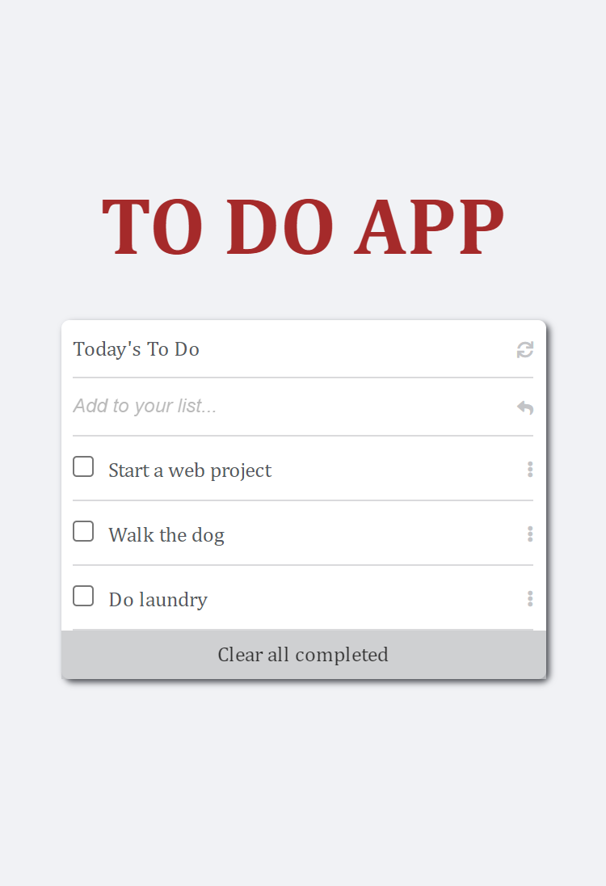

# TO DO LIST

> This project contains a to-do list project where tasks can be added, marked as completed and deleted

# Project Name

## To Do

# Live Website

Click [here](https://todolistsappp.netlify.app/) to view the website online.

# This project was built with:

HTML5

CSS3

JavaScript

Linters

Webpack

Website was deployed with Github Pages

# Version Control System

GIT

# Hosting Platform

Github

## Getting Started

To get a local copy up and running follow these simple steps.

- You can clone this repo by typing `git clone https://github.com/DammyShittu/ToDo-List-App.git` on your terminal.

- Type `cd ToDo-List-App` to access the project on the terminal.

# 👤 Author

GitHub: [@dammyShittu](https://github.com/DammyShittu/)

Twitter: [@aded_shittu](https://twitter.com/aded_shittu/)

LinkedIn: [Adedamola Shittu](linkedin.com/in/adedamola-shittu-3ab465172/)

# 🤝 Contributing

Contributions, issues, and feature requests are welcome!

Feel free to check the [issues page](https://github.com/DammyShittu/WeSingAfrica-Capstone/issues).

# Show your support

Give a ⭐️ if you like this project!

# 📝 License

This project is [MIT](LICENSE) licensed.
