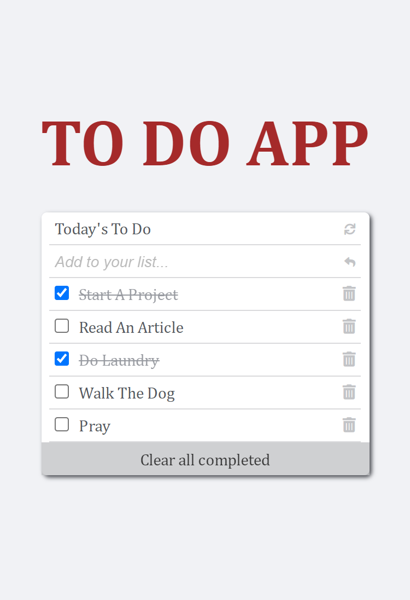

# TO DO LIST

 This project contains a to-do list project where tasks can be added, marked as completed and deleted.
 Users can edit a task by double clicking on the task title section.
 A task can be deleted by clicking on the trash can icon on the right side of each task.
 Tasks can be marked as `completed` by clicking on the corresponding checkbox.
 All completed tasks can be deleted at once by clicking the `Clear All Completed` button. 

# Project Name

## To Do

# Live Website

Click [here](https://dammyshittu.github.io/ToDo-List-App/) to view the website online.

# This project was built with:

HTML5

CSS3

JavaScript

Linters

Webpack

# Version Control System

GIT

# Hosting Platform

[Netlify](https://www.netlify.com/)

## Getting Started

To get a local copy up and running follow these simple steps.

- You can clone this repo by typing `git clone https://github.com/DammyShittu/ToDo-List-App.git` on your terminal.

- Type `cd ToDo-List-App` to access the project on the terminal.
  
- Run `npm install` from your editor's terminal.

- Run `npm run build` from your editor's terminal.

- Run `npm start` from your editor's terminal to view the project in your browser.

- Run `npx eslint .` . to check for JavaScript Linter errors.

- Run `npx stylelint "**/*.{css,scss}"` to check for CSS Linter errors.

# 👤 Author

GitHub: [@dammyShittu](https://github.com/DammyShittu/)

Twitter: [@aded_shittu](https://twitter.com/aded_shittu/)

LinkedIn: [Adedamola Shittu](linkedin.com/in/adedamola-shittu-3ab465172/)

# 🤝 Contributing

Contributions, issues, and feature requests are welcome!

Feel free to check the [issues page](https://github.com/DammyShittu/WeSingAfrica-Capstone/issues).

# Show your support

Give a ⭐️ if you like this project!

# 📝 License

This project is [MIT](LICENSE) licensed.
